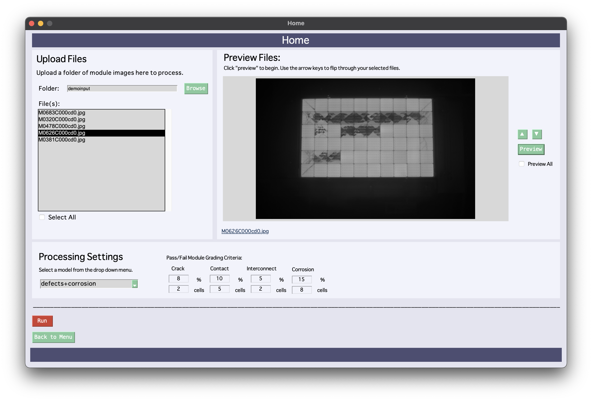

# BetterSolarUI 0.1.0
Initial release of the Better Solar User Interface for American Made Solar Challenge Round 5: Software Track Semifinals.

## Our Goals
* _Automate_ image interpretation and provide valuable statistics.
* Create a _user-friendly_ experience for a historically time-consuming image processing practice. 
* Provide an _all-in-one_ system that can be _tailored_ to fit a consumer's needs.


## What Does our Application Do?
In the solar industry there is a consistent influx of valuable Electroluminescence (EL) images, which become 
overwhelming and unmanagable. Inspecting these images easily becomes a tedious and monotonous process.

Our solution focuses on utilizing Machine Learning techniques to process these Electroluminescene (EL)
images and provide granular output with defect detection and localization of several defect categories. 
This output allows for further analysis on defect impact of overal module power, valuable to the customer.

(talk about defect categories somewhere??)


### Basic System Workflow
1. Upload **module** files and select custom processing settings on UI. (*See: 'Screenshots: Home Page Window'*)
2. Module files are fed into image preprocessing algorithm. Modules are split into individual cells.
3. Cell files processed with our ML cell level analysis and defect detection algorithms.
4. Analysis and defect detection results collected and outputted, allowed for display and viewing. (*See: 'Screenshots: Results Window'*)

### Screenshots

#### Home Page Window:
#### Results Window:
#### Image Review Window:


## Installation

Download ZIP folder above or use `gh repo clone mhalbert/BetterSolarUI`    (TODO! update for new repo!!!!!)

Using the above`requirements.txt` file, use terminal to easily install dependencies onto your dedicated environment with:
`pip install -r requirements.txt`


## User Guide
(For initial 0.1.0 Release of BetterSolarUI)

Folder Structure:
```
BetterSolarUI
  - demoinput\
  - demoout\
  - models\
  ...
  [ interface.py, process_cells.py, etc]
```
* Input files placed in: `demoinput`
  * Further example input found in `demoinput`. 
* Cell-cut modules outputted in: `images`
  * Pre-cut cell images may be used, just place them in `images\{module_name}\`, they will not get overwritten
* Processed files outputted in `demoout`
  * Once images are processed and run through our algorithms, they are _automatically_ populated here.
  * `demoout` folder contains folder(s) of processed module(s). 
* Defect Detection models placed in`models` 
  * These models are avaliable for selection via the UI.


## Release History
* 0.1.0
  * Initial Release for SET! Submission of American Made Solar Challenge Round 5: Software Track

## License

## Contact Us
Email us at _contact@bettersolargroup.com_. 


