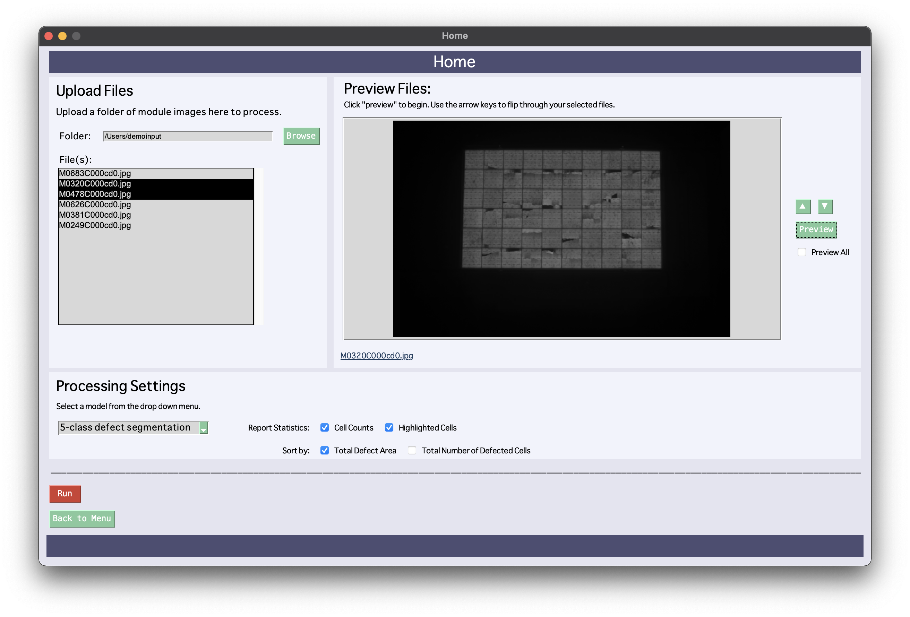
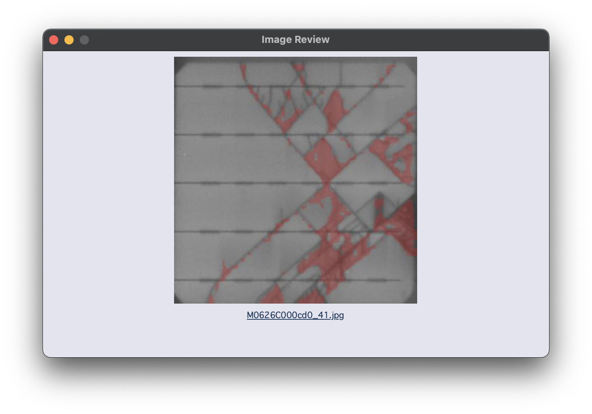

# BetterSolarUI 0.1.0
Initial release of the Better Solar User Interface for Round 5 American Made Solar Challenge Software Track Semifinals.

## What does our application do?
Our goal is to create a user-friendly experience for a historically tedious, time-consuming image processing practice. [Insert ML model info]

### System Workflow
1. Upload module files and select custom processing settings on UI. (See: 'Screenshots: Home Page Window')
2. Module files fed into image preprocessing algorithm. Modules splits into individual cells.
3. Cell files fed into cell level analysis and defect detection using our Machine Learning algorithm.
4. Analysis and defect detection results collected and outputted, allowed for display and viewing via UI. (See: 'Screenshots: Results Window')

### Screenshots

#### Home Page Window:
 

#### Results Window:


#### Image Review Window:



## Installation

Download ZIP above or use `gh repo clone mhalbert/BetterSolarUI`    <!--TODO! update for new repo!!!!!-->

Using the above`requirements.txt` file, use the terminal to easily install dependencies onto your dedicated environment with:
`pip install -r requirements.txt`

## User Guide
(For initial 0.1.0 Release of BetterSolarUI)

Folder Structure:
```
BetterSolarUI
  - demoinput\
  - demoout\
  - models\
  ...
  [ interface, processing, etc, files]
```
* User Input files placed in: `demoinput`
  * Example input found in `demoinput`. Input should be in module form. 
## Release History
* 0.1.0
  * Initial Release for SET! Submission of American Made Solar Challenge Round 5: Software Track

## License


